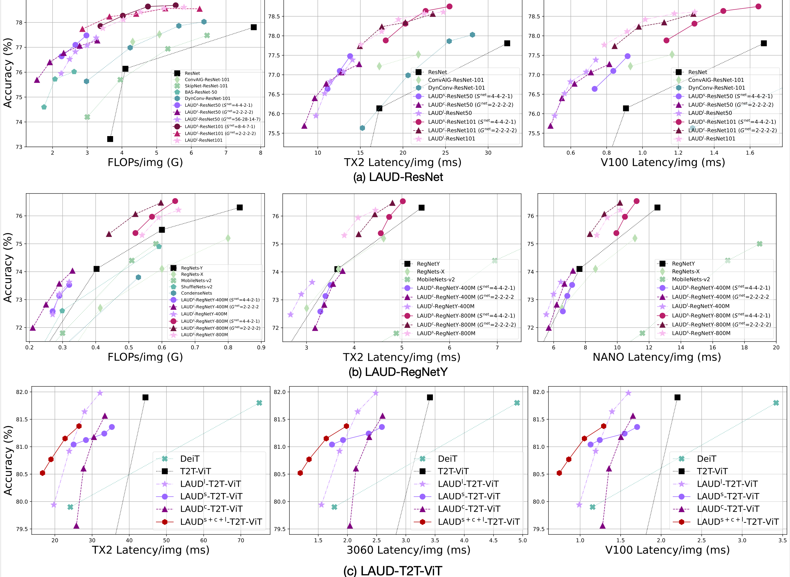

# LAUDNet

This is the official PyTorch implementation of "[**L**atency-**a**ware **U**nified **D**ynamic **Net**works for Efficient Image Recognition](https://arxiv.org/pdf/2308.15949.pdf)", which is the extension of our **NeurIPS 2022** paper: [Latency-Aware Spatial-wise Dynamic Networks](https://arxiv.org/abs/2210.06223). The original LASNet code is at [this URL](https://github.com/LeapLabTHU/LASNet).

## Introduction

We present ***Latency-aware Unified Dynamic Networks*** (LAUDNet), a unified framework that consolidates three representative dynamic paradigms: *spatial-wise adaptive computation*, *dynamic layer skipping* and *dynamic channel skipping* within a singular formulation. To accurately evaluate the **practical latency** of our model, we present a *latency predictor* that considers algorithms, scheduling strategies, hardware properties concurrently and accurately evaluates inference latency of **dynamic operators**. LAUDNet shows superior latency-accuracy tradeoff on a range of tasks (ImageNet classification, COCO object detection and instance segmentation) and a range of hardware devices (V100, RTX3090, RTX3060, TX2 and Nano).

## Usage

This repo consists of three components: code for *[ImageNet classification](imagenet_classification)*, *[MMDetection detection &amp; segmentation](mmdetection-2.21.0)* and *[latency predictor](DyNetSimulator)*.

### ImageNet classification
#### CNNs
Main dependencies:

- Python: 3.9
- PyTorch: 1.13.1
- Torchvision: 0.14.1
- Timm: 0.6.12

See a sample [training script](imagenet_classification/train_scripts.sh) for training details.

#### Vision Transformers

We implement the three dynamic-inference paradigms (i.e. token skipping, layer (block) skipping, and head (channel) skipping) based on the [AdaViT repo](https://www.github.com/MengLcool/AdaViT/tree/main).

### MMDetection detection & segmentation

#### RetinaNet, Faster-RCNN and MaskRCNN

Prerequisites:

1. Prepare an ImageNet pretrained LAUDNet model.
2. Setup a MMDetection-2.21.0 environment.
3. Replace corresponding files in your mmcv environment with files in [`mmcv_replace_file`](mmdetection-2.21.0/mmcv_replace_file).

See a sample [training script](mmdetection-2.21.0/tools/scripts_LAUDNet.sh) for training details.

#### DDQ-DETR and Mask2Former

Prerequisites:

1. Prepare an ImageNet pretrained LAUDNet model.
2. Setup a MMDetection-3.3.0 environment.

See a sample [training script](mmdetection-3.3.0/tools/scripts_LAUDNet.sh) for training details.

### Latency predictor

See a sample [evaluation script](DyNetSimulator/eval_example.py) for evaluation details.

## Performance



## Model Zoo

| model                                  | Checkpoint Link                                                           |
| -------------------------------------- | ------------------------------------------------------------------------- |
| LAUD-ResNet101 channel-2222 target-0.5 | [Tsinghua Cloud](https://cloud.tsinghua.edu.cn/f/13a660b58f1946a3b4f3/?dl=1) |
| LAUD-ResNet101 layer target-0.5        | [Tsinghua Cloud](https://cloud.tsinghua.edu.cn/f/625cfe8f6f244c39a5db/?dl=1) |

## Citation

```bibtex
@ARTICLE{han2024latency,
  author={Han, Yizeng and Liu, Zeyu and Yuan, Zhihang and Pu, Yifan and Wang, Chaofei and Song, Shiji and Huang, Gao},
  journal={IEEE Transactions on Pattern Analysis and Machine Intelligence}, 
  title={Latency-aware Unified Dynamic Networks for Efficient Image Recognition}, 
  year={2024},
  volume={},
  number={},
  pages={1-17},
  doi={10.1109/TPAMI.2024.3393530}
}
```


## Contact

If you have any questions, please feel free to contact the authors.

Yizeng Han: [hanyz18@mails.tsinghua.edu.cn](mailto:hanyz18@mails.tsinghua.edu.cn), [yizeng38@gmail.com](mailto:yizeng38@gmail.com).

Zeyu Liu: [liuzeyu20@mails.tsinghua.edu.cn](mailto:liuzeyu20@mails.tsinghua.edu.cn), [liuzeyu0020@gmail.com](mailto:liuzeyu0020@gmail.com).

Zhihang Yuan: [hahnyuan@gmail.com](mailto:hahnyuan@gmail.com).

Yifan Pu: [puyf23@mails.tsinghua.edu.cn](mailto:puyf@mails.tsinghua.edu.cn).
